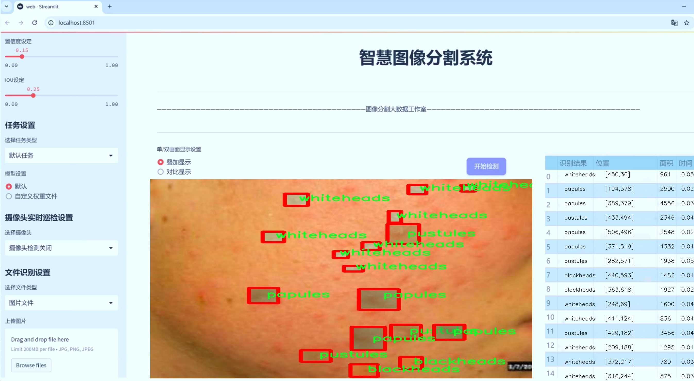

# 痤疮特征分割系统： yolov8-seg-p2

### 1.研究背景与意义

[参考博客](https://gitee.com/YOLOv8_YOLOv11_Segmentation_Studio/projects)

[博客来源](https://kdocs.cn/l/cszuIiCKVNis)

研究背景与意义

痤疮作为一种常见的皮肤疾病，影响着全球数以亿计的人群，尤其是青少年和年轻成年人。其发病机制复杂，主要与皮脂腺的过度活跃、毛囊角化异常、细菌感染以及炎症反应等因素密切相关。痤疮不仅对患者的身体健康造成影响，更在心理层面引发诸多问题，如自尊心下降、社交障碍等。因此，针对痤疮的早期诊断与治疗显得尤为重要。近年来，随着计算机视觉和深度学习技术的迅猛发展，基于图像处理的痤疮特征分析逐渐成为研究热点。

在这一背景下，基于改进YOLOv8的痤疮特征分割系统应运而生。YOLO（You Only Look Once）系列模型以其高效的实时目标检测能力和良好的准确性而受到广泛关注。YOLOv8作为该系列的最新版本，进一步提升了模型的性能，特别是在小目标检测和实例分割方面。通过对YOLOv8的改进，能够更好地适应痤疮特征的复杂性和多样性，从而实现对不同类型痤疮的精确分割与识别。

本研究所使用的数据集“AcnePut-In”包含1200张图像，涵盖了六种不同类型的痤疮特征，包括黑头、暗斑、结节、丘疹、脓疱和白头。这些类别的划分不仅反映了痤疮的不同病理特征，也为后续的特征分析和治疗方案提供了重要依据。通过对这些特征的准确分割，能够为临床医生提供更为直观的痤疮状态评估，进而制定个性化的治疗方案。

在痤疮的研究中，图像分割技术的应用具有重要的理论和实践意义。首先，通过对痤疮特征的精确分割，可以有效提高病变区域的识别率，减少误诊率，进而提升临床诊断的准确性。其次，基于深度学习的分割模型能够实现自动化处理，减少人工干预，提高工作效率，尤其在大规模筛查和监测中具有显著优势。此外，痤疮特征的分割结果还可以为后续的病理分析、疗效评估和新药研发提供数据支持。

综上所述，基于改进YOLOv8的痤疮特征分割系统不仅具有重要的学术价值，还在实际应用中展现出广阔的前景。通过对痤疮特征的深入研究与分析，能够为改善患者的生活质量、推动皮肤病学的研究进展提供有力支持。未来，随着技术的不断进步和数据集的不断丰富，基于深度学习的痤疮特征分割系统有望在临床应用中发挥更大的作用，为痤疮的早期诊断和个性化治疗开辟新的路径。

### 2.图片演示





注意：本项目提供完整的训练源码数据集和训练教程,由于此博客编辑较早,暂不提供权重文件（best.pt）,需要按照6.训练教程进行训练后实现上图效果。

### 3.视频演示

[3.1 视频演示](https://www.bilibili.com/video/BV1SPUUYLEgp/)

### 4.数据集信息

##### 4.1 数据集类别数＆类别名

nc: 6
names: ['blackheads', 'dark spot', 'nodules', 'papules', 'pustules', 'whiteheads']


##### 4.2 数据集信息简介

数据集信息展示

在本研究中，我们使用了名为“AcnePut-In”的数据集，旨在改进YOLOv8-seg模型在痤疮特征分割任务中的表现。该数据集专门为痤疮相关的皮肤特征提供了丰富的标注信息，包含六个主要类别，分别是黑头、暗斑、结节、丘疹、脓疱和白头。这些类别涵盖了痤疮的不同表现形式，使得模型能够在多样化的痤疮特征中进行有效的学习和识别。

“AcnePut-In”数据集的构建过程经过了严格的筛选和标注，确保每个类别的样本都具有代表性。黑头是痤疮中最常见的类型之一，通常表现为毛孔堵塞后形成的小黑点。暗斑则是由于炎症后色素沉着而形成的，常常影响皮肤的整体美观。结节是一种较为严重的痤疮类型，通常表现为坚硬的肿块，可能会伴随疼痛感。丘疹则是小而红的突起，通常是痤疮初期的表现。脓疱则是含有脓液的丘疹，常常伴随明显的炎症反应。最后，白头是被皮肤覆盖的闭合性粉刺，通常较难以察觉，但同样需要关注。

数据集中每个类别的样本数量经过精心设计，以确保模型在训练过程中能够接触到足够的多样性。这种多样性不仅体现在样本的数量上，还包括不同肤色、性别和年龄段的个体，确保模型的泛化能力。数据集中的图像质量也经过严格把关，确保每张图像都清晰可辨，能够有效支持特征提取和分割任务。

在数据集的标注过程中，采用了专业的皮肤科医生进行分类和标注，确保了标注的准确性和一致性。这一过程不仅提高了数据集的可信度，也为后续的模型训练提供了坚实的基础。通过这种高质量的标注，YOLOv8-seg模型能够更好地学习到各类痤疮特征的细微差别，从而在实际应用中实现更高的准确率和更好的分割效果。

此外，为了增强模型的鲁棒性，数据集还包含了一些具有挑战性的样本，例如不同光照条件下的图像、不同角度拍摄的样本以及部分模糊的图像。这些样本的引入旨在模拟真实世界中可能遇到的各种情况，使得训练出的模型在实际应用中能够更好地应对不同的场景。

总之，“AcnePut-In”数据集为改进YOLOv8-seg的痤疮特征分割系统提供了一个坚实的基础。通过对六个类别的深入研究和精细标注，我们期望能够提升模型在痤疮检测和分割任务中的表现，最终为临床应用提供更为有效的支持。这一数据集不仅是本研究的核心组成部分，也是推动痤疮相关研究向前发展的重要资源。


### 5.项目依赖环境部署教程（零基础手把手教学）

[5.1 环境部署教程链接（零基础手把手教学）](https://www.bilibili.com/video/BV1jG4Ve4E9t/?vd_source=bc9aec86d164b67a7004b996143742dc)


[5.2 安装Python虚拟环境创建和依赖库安装视频教程链接（零基础手把手教学）](https://www.bilibili.com/video/BV1nA4VeYEze/?vd_source=bc9aec86d164b67a7004b996143742dc)

### 6.手把手YOLOV8-seg训练视频教程（零基础手把手教学）

[6.1 手把手YOLOV8-seg训练视频教程（零基础小白有手就能学会）](https://www.bilibili.com/video/BV1cA4VeYETe/?vd_source=bc9aec86d164b67a7004b996143742dc)


按照上面的训练视频教程链接加载项目提供的数据集，运行train.py即可开始训练



     Epoch   gpu_mem       box       obj       cls    labels  img_size
     1/200     0G   0.01576   0.01955  0.007536        22      1280: 100%|██████████| 849/849 [14:42<00:00,  1.04s/it]
               Class     Images     Labels          P          R     mAP@.5 mAP@.5:.95: 100%|██████████| 213/213 [01:14<00:00,  2.87it/s]
                 all       3395      17314      0.994      0.957      0.0957      0.0843

     Epoch   gpu_mem       box       obj       cls    labels  img_size
     2/200     0G   0.01578   0.01923  0.007006        22      1280: 100%|██████████| 849/849 [14:44<00:00,  1.04s/it]
               Class     Images     Labels          P          R     mAP@.5 mAP@.5:.95: 100%|██████████| 213/213 [01:12<00:00,  2.95it/s]
                 all       3395      17314      0.996      0.956      0.0957      0.0845

     Epoch   gpu_mem       box       obj       cls    labels  img_size
     3/200     0G   0.01561    0.0191  0.006895        27      1280: 100%|██████████| 849/849 [10:56<00:00,  1.29it/s]
               Class     Images     Labels          P          R     mAP@.5 mAP@.5:.95: 100%|███████   | 187/213 [00:52<00:00,  4.04it/s]
                 all       3395      17314      0.996      0.957      0.0957      0.0845


### 7.50+种全套YOLOV8-seg创新点加载调参实验视频教程（一键加载写好的改进模型的配置文件）

[7.1 50+种全套YOLOV8-seg创新点加载调参实验视频教程（一键加载写好的改进模型的配置文件）](https://www.bilibili.com/video/BV1Hw4VePEXv/?vd_source=bc9aec86d164b67a7004b996143742dc)

### YOLOV8-seg算法简介

原始YOLOv8-seg算法原理

YOLOv8-seg算法是YOLO系列中的最新成员，旨在为目标检测和分割任务提供高效的解决方案。与其前身YOLOv5相比，YOLOv8在检测精度和速度上都取得了显著的提升。YOLOv8的设计考虑了不同应用场景的需求，提供了多种模型版本，包括n、s、m、l和x五种不同规模的模型，以适应不同的计算资源和精度要求。尤其是YOLOv8n，作为参数量最小且检测速度最快的版本，成为了许多实时应用的首选。

YOLOv8的网络结构可以分为四个主要部分：输入端、骨干网络、颈部网络和头部网络。输入端负责数据预处理，包括马赛克数据增强、自适应锚框计算和自适应灰度填充等。这些技术不仅提高了模型的鲁棒性，还有效地增强了训练数据的多样性。骨干网络采用了C2f和SPPF（空间金字塔池化融合）结构，C2f模块是YOLOv8的核心特征提取模块。该模块通过多分支跨层连接的方式，丰富了梯度流，增强了特征表示能力。这种设计灵感来源于YOLOv7的ELAN结构，旨在通过更复杂的连接方式，提升模型对特征的学习能力。

颈部网络则采用了路径聚合网络（PAN）结构，旨在加强对不同尺度对象的特征融合能力。PAN通过在不同层次之间进行特征传递，使得模型能够更好地捕捉到目标的多尺度信息，从而提升检测的准确性。头部网络则将分类和检测过程进行解耦，主要包括损失计算和目标检测框的筛选。在损失计算方面，YOLOv8引入了Task-Aligned Assigner策略，根据分类与回归的分数加权结果选择正样本，优化了样本分配的效率。

YOLOv8的创新之处还体现在其头部网络的设计上。与传统的锚框检测方法不同，YOLOv8采用了无锚框（Anchor-Free）检测策略，直接预测目标的中心点和宽高比例。这一变化显著减少了锚框的数量，简化了非最大抑制（NMS）过程，从而加速了目标检测的速度和准确度。此外，YOLOv8在损失计算方面也进行了改进，分类分支使用二元交叉熵损失（BCELoss），而回归分支则结合了分布焦点损失（DFLoss）和完全交并比损失（CIOULoss），以提升模型对边界框预测的精准性。

在YOLOv8-seg算法中，目标分割的任务同样得到了重视。通过在YOLOv8的基础上增加分割头，YOLOv8-seg能够同时完成目标检测和实例分割。分割头的设计采用了特征金字塔网络（FPN）和路径聚合网络（PAN）的结合，确保了不同尺度特征的有效融合。通过这种方式，YOLOv8-seg不仅能够准确定位目标，还能为每个目标生成精确的分割掩码，从而实现更为细致的目标识别。

YOLOv8-seg的整体架构在轻量化和高效性方面表现突出，特别是在实时应用场景中，能够在保证精度的前提下，实现快速的目标检测和分割。这一算法的成功实现，得益于其在网络结构、损失计算和数据增强等多个方面的创新与优化。通过不断的实验与调优，YOLOv8-seg在多个标准数据集上展现了优异的性能，成为了目标检测与分割领域的一个重要里程碑。

总的来说，YOLOv8-seg算法的原理是通过高效的特征提取、灵活的网络结构设计和先进的损失计算策略，来实现快速且准确的目标检测与分割。其创新的无锚框检测方法和解耦合的头部结构，使得YOLOv8-seg在面对复杂场景时，能够保持高效的处理能力和优异的检测性能。随着YOLOv8-seg的不断发展和应用，其在智能监控、自动驾驶、医学影像等领域的潜力将进一步得到挖掘，为未来的研究和应用提供了广阔的前景。


### 9.系统功能展示（检测对象为举例，实际内容以本项目数据集为准）

图9.1.系统支持检测结果表格显示

  图9.2.系统支持置信度和IOU阈值手动调节

  图9.3.系统支持自定义加载权重文件best.pt(需要你通过步骤5中训练获得)

  图9.4.系统支持摄像头实时识别

  图9.5.系统支持图片识别

  图9.6.系统支持视频识别

  图9.7.系统支持识别结果文件自动保存

  图9.8.系统支持Excel导出检测结果数据


### 10.50+种全套YOLOV8-seg创新点原理讲解（非科班也可以轻松写刊发刊，V11版本正在科研待更新）

#### 10.1 由于篇幅限制，每个创新点的具体原理讲解就不一一展开，具体见下列网址中的创新点对应子项目的技术原理博客网址【Blog】：


[10.1 50+种全套YOLOV8-seg创新点原理讲解链接](https://gitee.com/qunmasj/good)

#### 10.2 部分改进模块原理讲解(完整的改进原理见上图和技术博客链接)【如果此小节的图加载失败可以通过CSDN或者Github搜索该博客的标题访问原始博客，原始博客图片显示正常】

### YOLOv8模型
YOLOv8模型由Ultralytics团队在YOLOv5模型的基础上，吸收了近两年半来经过实际验证的各种改进，于2023年1月提出。与之前的一些YOLO 系列模型想类似，YOLOv8模型也有多种尺寸，下面以YOLOv8n为例，分析 YOLOv8模型的结构和改进点。YOLOv8模型网络结构如
输入图片的部分，由于发现Mosaic数据增强尽管这有助于提升模型的鲁棒性和泛化性，但是，在一定程度上，也会破坏数据的真实分布，使得模型学习到一些不好的信息。所以YOLOv8模型在训练中的最后10个epoch 停止使用Mosaic数据增强。


在网络结构上，首先主干网络的改变不大，主要是将C3模块替换为了C2f模块，该模块的结构在上图中已示出。C2f模块在C3模块的思路基础上，引入了YOLOv7中 ELAN的思路，引入了更多的跳层连接，这有助于该模块获得更丰富的梯度流信息，而且模型的轻量化得到了保证。依然保留了SPPF，效果不变的同时减少了该模块的执行时间。
在颈部网络中，也是将所有的C3模块更改为C2f模块，同时删除了两处上采样之前的卷积连接层。
在头部网络中，采用了YOLOX中使用的解耦头的思路，两条并行的分支分别提取类别和位置特征。由于分类任务更注重于分析特征图中提取到的特征与已输入图片的部分，由于发现 Mosaic数据增强尽管这有助于提升模型的鲁棒性和泛化性，但是，在一定程度上，也会破坏数据的真实分布，使得模型学习到一些不好的信息。所以YOLOv8模型在训练中的最后10个epoch停止使用Mosaic数据增强。
在网络结构上，首先主干网络的改变不大，主要是将C3模块替换为了C2f模块，该模块的结构在上图中已示出。C2f模块在C3模块的思路基础上，引入了YOLOv7中ELAN的思路，引入了更多的跳层连接，这有助于该模块获得更丰富的梯度流信息，而且模型的轻量化得到了保证。依然保留了SPPF，效果不变的同时减少了该模块的执行时间。
在颈部网络中，也是将所有的C3模块更改为C2f模块，同时删除了两处上采样之前的卷积连接层。
在头部网络中，采用了YOLOX中使用的解耦头的思路，两条并行的分支分别提取类别和位置特征。由于分类任务更注重于分析特征图中提取到的特征与已有类别中的哪一种更为相似，而定位任务更关注边界框与真值框的位置关系，并据此对边界框的坐标进行调整。侧重点的不同使得在使用两个检测头时收敛的速度和预测的精度有所提高。而且使用了无锚框结构，直接预测目标的中心，并使用TAL (Task Alignment Learning，任务对齐学习）来区分正负样本，引入了分类分数和IOU的高次幂乘积作为衡量任务对齐程度的指标，认为同时拥有好的定位和分类评价的在分类和定位损失函数中也引入了这项指标。
在模型的检测结果上，YOLOv8模型也取得了较好的成果，图为官方在coCO数据集上 YOLOv8模型的模型尺寸大小和检测的mAP50-95对比图。mAP50-95指的是IOU的值从50%取到95%，步长为5%，然后算在这些IOU下的mAP的均值。图的 a）图展示了YOLOv8在同尺寸下模型中参数没有较大增加的前提下取得了比其他模型更好的精度，图2-17的b)图展示了YOLOv8比其他YOLO系列模型在同尺寸时，推理速度更快且精度没有太大下降。


### 视觉transformer(ViT)简介
视觉transformer(ViT)最近在各种计算机视觉任务中证明了巨大的成功，并受到了相当多的关注。与卷积神经网络(CNNs)相比，ViT具有更强的全局信息捕获能力和远程交互能力，表现出优于CNNs的准确性，特别是在扩大训练数据大小和模型大小时[An image is worth 16x16 words: Transformers for image recognition at scale,Coatnet]。

尽管ViT在低分辨率和高计算领域取得了巨大成功，但在高分辨率和低计算场景下，ViT仍不如cnn。例如，下图(左)比较了COCO数据集上当前基于cnn和基于vit的一级检测器。基于vit的检测器(160G mac)和基于cnn的检测器(6G mac)之间的效率差距超过一个数量级。这阻碍了在边缘设备的实时高分辨率视觉应用程序上部署ViT。


左图:现有的基于vit的一级检测器在实时目标检测方面仍然不如当前基于cnn的一级检测器，需要的计算量多出一个数量级。本文引入了第一个基于vit的实时对象检测器来弥补这一差距。在COCO上，efficientvit的AP比efficientdet高3.8，而mac较低。与YoloX相比，efficient ViT节省67.2%的计算成本，同时提供更高的AP。

中:随着输入分辨率的增加，计算成本呈二次增长，无法有效处理高分辨率的视觉应用。

右图:高分辨率对图像分割很重要。当输入分辨率从1024x2048降低到512x1024时，MobileNetV2的mIoU减少12% (8.5 mIoU)。在不提高分辨率的情况下，只提高模型尺寸是无法缩小性能差距的。

ViT的根本计算瓶颈是softmax注意模块，其计算成本随输入分辨率的增加呈二次增长。例如，如上图(中)所示，随着输入分辨率的增加，vit- small[Pytorch image models. https://github.com/rwightman/ pytorch-image-models]的计算成本迅速显著大于ResNet-152的计算成本。

解决这个问题的一个直接方法是降低输入分辨率。然而，高分辨率的视觉识别在许多现实世界的计算机视觉应用中是必不可少的，如自动驾驶，医疗图像处理等。当输入分辨率降低时，图像中的小物体和精细细节会消失，导致目标检测和语义分割性能显著下降。

上图(右)显示了在cityscape数据集上不同输入分辨率和宽度乘法器下MobileNetV2的性能。例如，将输入分辨率从1024x2048降低到512x1024会使cityscape的性能降低12% (8.5 mIoU)。即使是3.6倍高的mac，只放大模型尺寸而不增加分辨率也无法弥补这一性能损失。

除了降低分辨率外，另一种代表性的方法是限制softmax注意，方法是将其范围限制在固定大小的局部窗口内[Swin transformer,Swin transformer v2]或降低键/值张量的维数[Pyramid vision transformer,Segformer]。然而，它损害了ViT的非局部注意能力，降低了全局接受域(ViT最重要的优点)，使得ViT与大内核cnn的区别更小[A convnet for the 2020s,Scaling up your kernels to 31x31: Revisiting large kernel design in cnns,Lite pose: Efficient architecture design for 2d human pose estimation]。

本文介绍了一个有效的ViT体系结构，以解决这些挑战。发现没有必要坚持softmax注意力。本文建议用线性注意[Transformers are rnns: Fast autoregressive transformers with linear attention]代替softmax注意。

线性注意的关键好处是，它保持了完整的n 2 n^2n 2
 注意映射，就像softmax注意。同时，它利用矩阵乘法的联想特性，避免显式计算完整的注意映射，同时保持相同的功能。因此，它保持了softmax注意力的全局特征提取能力，且计算复杂度仅为线性。线性注意的另一个关键优点是它避免了softmax，这使得它在移动设备上更有效(下图左)。


左图:线性注意比类似mac下的softmax注意快3.3-4.5倍，这是因为去掉了硬件效率不高的softmax功能。延迟是在Qualcomm Snapdragon 855 CPU和TensorFlow-Lite上测量的。本文增加线性注意的头部数量，以确保它具有与softmax注意相似的mac。

中:然而，如果没有softmax注意中使用的非线性注意评分归一化，线性注意无法有效集中其注意分布，削弱了其局部特征提取能力。后文提供了可视化。

右图:本文用深度卷积增强线性注意，以解决线性注意的局限性。深度卷积可以有效地捕捉局部特征，而线性注意可以专注于捕捉全局信息。增强的线性注意在保持线性注意的效率和简单性的同时，表现出在各种视觉任务上的强大表现(图4)。

然而，直接应用线性注意也有缺点。以往的研究表明线性注意和softmax注意之间存在显著的性能差距(下图中间)。


左:高通骁龙855上的精度和延迟权衡。效率vit比效率网快3倍，精度更高。中:ImageNet上softmax注意与线性注意的比较。在相同的计算条件下，本文观察到softmax注意与线性注意之间存在显著的精度差距。而深度卷积增强模型后，线性注意的精度有明显提高。

相比之下，softmax注意的精度变化不大。在相同MAC约束下，增强线性注意比增强软最大注意提高了0.3%的精度。右图:与增强的softmax注意相比，增强的线性注意硬件效率更高，随着分辨率的增加，延迟增长更慢。

深入研究线性注意和softmax注意的详细公式，一个关键的区别是线性注意缺乏非线性注意评分归一化方案。这使得线性注意无法有效地将注意力分布集中在局部模式产生的高注意分数上，从而削弱了其局部特征提取能力。

本文认为这是线性注意的主要限制，使其性能不如softmax注意。本文提出了一个简单而有效的解决方案来解决这一限制，同时保持线性注意在低复杂度和低硬件延迟方面的优势。具体来说，本文建议通过在每个FFN层中插入额外的深度卷积来增强线性注意。因此，本文不需要依赖线性注意进行局部特征提取，避免了线性注意在捕捉局部特征方面的不足，并利用了线性注意在捕捉全局特征方面的优势。

本文广泛评估了efficient vit在低计算预算下对各种视觉任务的有效性，包括COCO对象检测、城市景观语义分割和ImageNet分类。本文想要突出高效的主干设计，所以没有包括任何正交的附加技术(例如，知识蒸馏，神经架构搜索)。尽管如此，在COCO val2017上，efficientvit的AP比efficientdet - d1高2.4倍，同时节省27.9%的计算成本。在cityscape上，efficientvit提供了比SegFormer高2.5个mIoU，同时降低了69.6%的计算成本。在ImageNet上，efficientvit在584M mac上实现了79.7%的top1精度，优于efficientnet - b1的精度，同时节省了16.6%的计算成本。

与现有的以减少参数大小或mac为目标的移动ViT模型[Mobile-former,Mobilevit,NASVit]不同，本文的目标是减少移动设备上的延迟。本文的模型不涉及复杂的依赖或硬件低效操作。因此，本文减少的计算成本可以很容易地转化为移动设备上的延迟减少。

在高通骁龙855 CPU上，efficient vit运行速度比efficientnet快3倍，同时提供更高的ImageNet精度。本文的代码和预训练的模型将在出版后向公众发布。

### Efficient Vision Transformer.
提高ViT的效率对于在资源受限的边缘平台上部署ViT至关重要，如手机、物联网设备等。尽管ViT在高计算区域提供了令人印象深刻的性能，但在针对低计算区域时，它通常不如以前高效的cnn[Efficientnet, mobilenetv3,Once for all: Train one network and specialize it for efficient deployment]。为了缩小差距，MobileViT建议结合CNN和ViT的长处，使用transformer将卷积中的局部处理替换为全局处理。MobileFormer提出了在MobileNet和Transformer之间建立双向桥以实现特征融合的并行化。NASViT提出利用神经架构搜索来搜索高效的ViT架构。

这些模型在ImageNet上提供了极具竞争力的准确性和效率的权衡。然而，它们并不适合高分辨率的视觉任务，因为它们仍然依赖于softmax注意力。


在本节中，本文首先回顾了自然语言处理中的线性注意，并讨论了它的优缺点。接下来，本文介绍了一个简单而有效的解决方案来克服线性注意的局限性。最后，给出了efficient vit的详细架构。

 为可学习投影矩阵。Oi表示矩阵O的第i行。Sim(·，·)为相似度函数。

虽然softmax注意力在视觉和NLP方面非常成功，但它并不是唯一的选择。例如，线性注意提出了如下相似度函数:


其中，φ(·)为核函数。在本工作中，本文选择了ReLU作为内核函数，因为它对硬件来说是友好的。当Sim(Q, K) = φ(Q)φ(K)T时，式(1)可改写为:


线性注意的一个关键优点是，它允许利用矩阵乘法的结合律，在不改变功能的情况下，将计算复杂度从二次型降低到线性型:


除了线性复杂度之外，线性注意的另一个关键优点是它不涉及注意模块中的softmax。Softmax在硬件上效率非常低。避免它可以显著减少延迟。例如，下图(左)显示了softmax注意和线性注意之间的延迟比较。在类似的mac上，线性注意力比移动设备上的softmax注意力要快得多。


#### EfficientViT
Enhancing Linear Attention with Depthwise Convolution

虽然线性注意在计算复杂度和硬件延迟方面优于softmax注意，但线性注意也有局限性。以往的研究[\[Luna: Linear unified nested attention,Random feature attention,Combiner: Full attention transformer with sparse computation cost,cosformer: Rethinking softmax in attention\]](https://afdian.net/item/602b9612927111ee9ec55254001e7c00)表明，在NLP中线性注意和softmax注意之间通常存在显著的性能差距。对于视觉任务，之前的研究[Visual correspondence hallucination,Quadtree attention for vision transformers]也表明线性注意不如softmax注意。在本文的实验中，本文也有类似的观察结果(图中)。


本文对这一假设提出了质疑，认为线性注意的低劣性能主要是由于局部特征提取能力的丧失。如果没有在softmax注意中使用的非线性评分归一化，线性注意很难像softmax注意那样集中其注意分布。下图(中间)提供了这种差异的示例。


在相同的原始注意力得分下，使用softmax比不使用softmax更能集中注意力。因此，线性注意不能有效地聚焦于局部模式产生的高注意分数(下图)，削弱了其局部特征提取能力。


注意图的可视化显示了线性注意的局限性。通过非线性注意归一化，softmax注意可以产生清晰的注意分布，如中间行所示。相比之下，线性注意的分布相对平滑，使得线性注意在捕捉局部细节方面的能力较弱，造成了显著的精度损失。本文通过深度卷积增强线性注意来解决这一限制，并有效提高了准确性。

介绍了一个简单而有效的解决方案来解决这个限制。本文的想法是用卷积增强线性注意，这在局部特征提取中是非常有效的。这样，本文就不需要依赖于线性注意来捕捉局部特征，而可以专注于全局特征提取。具体来说，为了保持线性注意的效率和简单性，本文建议在每个FFN层中插入一个深度卷积，这样计算开销很小，同时极大地提高了线性注意的局部特征提取能力。

#### Building Block

下图(右)展示了增强线性注意的详细架构，它包括一个线性注意层和一个FFN层，在FFN的中间插入深度卷积。


与之前的方法[Swin transformer,Coatnet]不同，本文在efficientvit中没有使用相对位置偏差。相对位置偏差虽然可以改善模型的性能，但它使模型容易受到分辨率变化[Segformer]的影响。多分辨率训练或新分辨率下的测试在检测和分割中很常见。去除相对位置偏差使高效率vit对输入分辨率更加灵活。

与之前低计算CNNs[Mobilenetv2,mobilenetv3]的设计不同，本文为下采样块添加了额外的下采样快捷方式。每个下采样快捷方式由一个平均池和一个1x1卷积组成。在本文的实验中，这些额外的下采样快捷方式可以稳定训练效率，提高性能。

#### Macro Architecture

下图说明了efficientvit的宏观体系结构。它由输入 stem 和4级组成。最近的研究[Coatnet,Levit,Early convolutions help transformers see better]表明在早期阶段使用卷积对ViT更好。本文遵循这个设计，在第三阶段开始使用增强的线性注意。


EfficientViT宏观架构。本文从第三阶段开始使用增强的线性注意。P2、P3和P4形成了一个金字塔特征图，用于检测和分割。P4用于分类。

为了突出高效的主干本身，本文对MBConv和FFN使用相同的扩展比e (e = 4)保持超参数简单，对所有深度卷积使用相同的内核大小k(除了输入stem)，对所有层使用相同的激活函数(hard swish)。

P2、P3和P4表示阶段2、3和4的输出，形成了特征图的金字塔。本文按照惯例将P2、P3和P4送至检测头。本文使用Yolov8进行检测。为了分割，本文融合了P2和P4。融合特征被馈送到一个轻量级头，包括几个卷积层，遵循Fast-SCNN。为了分类，本文将P4输入到轻量级头部，与MobileNetV3相同。


### 11.项目核心源码讲解（再也不用担心看不懂代码逻辑）

#### 11.1 web.py

以下是代码中最核心的部分，经过精简和详细注释的版本：

```python
import cv2
import numpy as np
from PIL import ImageFont, ImageDraw, Image
from hashlib import md5

def calculate_polygon_area(points):
    """
    计算多边形的面积
    :param points: 多边形的顶点坐标，类型为 Nx2 的numpy数组
    :return: 多边形的面积
    """
    if len(points) < 3:  # 多边形至少需要3个顶点
        return 0
    return cv2.contourArea(points)

def draw_with_chinese(image, text, position, font_size=20, color=(255, 0, 0)):
    """
    在OpenCV图像上绘制中文文字
    :param image: 输入的图像
    :param text: 要绘制的文本
    :param position: 文本的位置 (x, y)
    :param font_size: 字体大小
    :param color: 字体颜色
    :return: 绘制后的图像
    """
    # 将图像从 OpenCV 格式（BGR）转换为 PIL 格式（RGB）
    image_pil = Image.fromarray(cv2.cvtColor(image, cv2.COLOR_BGR2RGB))
    draw = ImageDraw.Draw(image_pil)
    # 使用指定的字体
    font = ImageFont.truetype("simsun.ttc", font_size, encoding="unic")
    draw.text(position, text, font=font, fill=color)
    # 将图像从 PIL 格式（RGB）转换回 OpenCV 格式（BGR）
    return cv2.cvtColor(np.array(image_pil), cv2.COLOR_RGB2BGR)

def generate_color_based_on_name(name):
    """
    根据名称生成稳定的颜色
    :param name: 输入的名称
    :return: 生成的颜色（BGR格式）
    """
    hash_object = md5(name.encode())
    hex_color = hash_object.hexdigest()[:6]  # 取前6位16进制数
    r, g, b = int(hex_color[0:2], 16), int(hex_color[2:4], 16), int(hex_color[4:6], 16)
    return (b, g, r)  # OpenCV 使用BGR格式

def draw_detections(image, info, alpha=0.2):
    """
    在图像上绘制检测结果
    :param image: 输入的图像
    :param info: 检测信息，包括类别名称、边界框、置信度等
    :param alpha: 透明度
    :return: 绘制后的图像和目标面积
    """
    name, bbox, conf, cls_id, mask = info['class_name'], info['bbox'], info['score'], info['class_id'], info['mask']
    x1, y1, x2, y2 = bbox
    aim_frame_area = (x2 - x1) * (y2 - y1)  # 计算目标面积
    cv2.rectangle(image, (x1, y1), (x2, y2), color=(0, 0, 255), thickness=3)  # 绘制边界框
    image = draw_with_chinese(image, name, (x1, y1 - 10), font_size=20)  # 绘制类别名称
    return image, aim_frame_area

class Detection_UI:
    """
    检测系统类
    """
    def __init__(self):
        """
        初始化检测系统的参数
        """
        self.conf_threshold = 0.15  # 默认置信度阈值
        self.iou_threshold = 0.5  # 默认IOU阈值
        self.model = None  # 模型实例
        self.colors = []  # 类别颜色列表

    def frame_process(self, image):
        """
        处理并预测单个图像帧的内容
        :param image: 输入的图像
        :return: 处理后的图像，检测信息
        """
        pre_img = self.model.preprocess(image)  # 对图像进行预处理
        params = {'conf': self.conf_threshold, 'iou': self.iou_threshold}
        self.model.set_param(params)  # 设置模型参数
        pred = self.model.predict(pre_img)  # 使用模型进行预测
        detInfo = []  # 初始化检测信息列表

        if pred is not None and len(pred):
            det_info = self.model.postprocess(pred)  # 后处理预测结果
            for info in det_info:
                image, aim_frame_area = draw_detections(image, info)  # 绘制检测结果
                detInfo.append([info['class_name'], info['bbox'], aim_frame_area])  # 添加检测信息

        return image, detInfo

# 实例化并运行应用
if __name__ == "__main__":
    app = Detection_UI()
    # 此处可以添加代码来启动应用
```

### 代码核心部分说明：
1. **计算多边形面积**：`calculate_polygon_area` 函数用于计算多边形的面积，输入为多边形的顶点坐标。
2. **绘制中文文本**：`draw_with_chinese` 函数在图像上绘制中文文本，使用PIL库处理字体。
3. **生成颜色**：`generate_color_based_on_name` 函数根据名称生成稳定的颜色，使用MD5哈希算法。
4. **绘制检测结果**：`draw_detections` 函数在图像上绘制检测框和类别名称，并计算目标面积。
5. **检测系统类**：`Detection_UI` 类负责初始化检测系统的参数和处理图像帧的逻辑。`frame_process` 方法用于处理图像并返回检测结果。

这些核心部分是整个检测系统的基础，负责图像处理、检测结果的绘制和展示。

这个 `web.py` 文件是一个基于 Streamlit 的图像分割和目标检测应用程序。它的主要功能是通过摄像头或上传的图片和视频文件进行目标检测，并在界面上展示检测结果。以下是对代码的逐步分析和说明。

首先，程序导入了一系列必要的库，包括用于图像处理的 OpenCV 和 NumPy，用户界面构建的 Streamlit，以及其他一些自定义模块和工具函数。这些库为后续的图像处理、模型加载和用户交互提供了支持。

在代码中定义了一些实用函数，例如 `calculate_polygon_area` 用于计算多边形的面积，`draw_with_chinese` 用于在图像上绘制中文文本，`generate_color_based_on_name` 用于根据名称生成稳定的颜色，`adjust_parameter` 用于根据图像大小调整参数等。这些函数为后续的图像处理和结果展示提供了基础功能。

接下来，定义了一个 `Detection_UI` 类，该类封装了整个检测系统的逻辑和界面。构造函数中初始化了一些参数，包括模型类型、置信度阈值、IOU 阈值、上传的文件、检测结果等。它还调用了一些方法来设置页面和侧边栏的布局，并加载模型。

在 `setup_page` 和 `setup_sidebar` 方法中，设置了 Streamlit 页面和侧边栏的布局，包括置信度和 IOU 阈值的滑动条、模型选择下拉框、摄像头选择、文件上传等。这些设置允许用户根据需求自定义检测的参数和输入源。

`process_camera_or_file` 方法是核心处理逻辑，根据用户选择的输入源（摄像头或文件）进行相应的处理。如果选择了摄像头，它会打开摄像头并逐帧捕获图像，调用 `frame_process` 方法进行目标检测，并将结果展示在界面上。如果选择了上传的文件，则读取文件并进行处理。

`frame_process` 方法对每一帧图像进行预处理、模型预测和后处理，提取检测结果并绘制检测框和标签。它还会将检测信息记录到日志表中，以便后续查看和导出。

此外，`toggle_comboBox` 方法用于处理用户选择的帧 ID，显示对应帧的检测结果。`frame_table_process` 方法则用于更新显示的图像和检测结果。

最后，`setupMainWindow` 方法负责构建主窗口的布局，包括图像显示区域、结果表格和控制按钮等。用户可以通过点击“开始检测”按钮启动检测过程。

整个程序通过 Streamlit 提供了一个交互式的用户界面，用户可以方便地进行目标检测，查看检测结果，并导出结果文件。整体结构清晰，功能模块化，便于后续的维护和扩展。

#### 11.2 ultralytics\models\yolo\segment\__init__.py

```python
# Ultralytics YOLO 🚀, AGPL-3.0 license

# 从当前模块导入SegmentationPredictor、SegmentationTrainer和SegmentationValidator类
from .predict import SegmentationPredictor
from .train import SegmentationTrainer
from .val import SegmentationValidator

# 定义当前模块的公开接口，指定可以被外部访问的类
__all__ = 'SegmentationPredictor', 'SegmentationTrainer', 'SegmentationValidator'
```

### 代码详细注释：
1. **导入模块**：
   - `from .predict import SegmentationPredictor`：从当前包的`predict`模块中导入`SegmentationPredictor`类，通常用于图像分割的预测功能。
   - `from .train import SegmentationTrainer`：从当前包的`train`模块中导入`SegmentationTrainer`类，负责训练图像分割模型。
   - `from .val import SegmentationValidator`：从当前包的`val`模块中导入`SegmentationValidator`类，用于验证训练好的模型的性能。

2. **定义公开接口**：
   - `__all__`是一个特殊变量，用于定义当前模块中可以被外部导入的对象。这里将`SegmentationPredictor`、`SegmentationTrainer`和`SegmentationValidator`三个类列入其中，表示它们是模块的核心功能部分，外部用户可以直接使用这些类。

这个程序文件是Ultralytics YOLO（一个流行的目标检测和分割模型）库中的一个初始化文件，位于`ultralytics/models/yolo/segment/`目录下。文件的主要功能是导入和定义该模块中可用的类或功能。

首先，文件开头的注释`# Ultralytics YOLO 🚀, AGPL-3.0 license`表明这是Ultralytics YOLO项目的一部分，并且使用的是AGPL-3.0许可证，这意味着该代码是开源的，并且遵循特定的使用条款。

接下来，文件通过`from .predict import SegmentationPredictor`、`from .train import SegmentationTrainer`和`from .val import SegmentationValidator`三行代码导入了三个类。这些类分别负责图像分割任务中的不同功能：

- `SegmentationPredictor`：这个类可能用于执行图像分割的预测，处理输入数据并生成分割结果。
- `SegmentationTrainer`：这个类用于训练模型，负责模型的训练过程，包括数据加载、损失计算和参数更新等。
- `SegmentationValidator`：这个类用于验证模型的性能，通常在训练后评估模型在验证集上的表现。

最后，`__all__`变量定义了模块的公共接口，指定了当使用`from module import *`语句时，哪些名称会被导入。在这里，它包含了`SegmentationPredictor`、`SegmentationTrainer`和`SegmentationValidator`，这意味着这三个类是该模块的主要组成部分，用户可以直接使用它们。

总的来说，这个文件的作用是组织和导出与图像分割相关的功能，使得用户能够方便地使用这些类进行预测、训练和验证。

#### 11.3 ultralytics\utils\checks.py

以下是经过简化并添加详细中文注释的核心代码部分：

```python
import os
import re
import subprocess
from pathlib import Path
from typing import Optional
import torch
from ultralytics.utils import LOGGER, ROOT

def parse_requirements(file_path=ROOT.parent / 'requirements.txt', package=''):
    """
    解析 requirements.txt 文件，忽略以 '#' 开头的行及 '#' 后的文本。

    参数:
        file_path (Path): requirements.txt 文件的路径。
        package (str, optional): 要使用的 Python 包名，默认为空。

    返回:
        (List[Dict[str, str]]): 解析后的需求列表，每个需求为字典形式，包含 `name` 和 `specifier` 键。
    """
    if package:
        # 如果指定了包名，则获取该包的依赖
        requires = [x for x in metadata.distribution(package).requires if 'extra == ' not in x]
    else:
        # 否则读取 requirements.txt 文件
        requires = Path(file_path).read_text().splitlines()

    requirements = []
    for line in requires:
        line = line.strip()
        if line and not line.startswith('#'):
            line = line.split('#')[0].strip()  # 忽略行内注释
            match = re.match(r'([a-zA-Z0-9-_]+)\s*([<>!=~]+.*)?', line)
            if match:
                requirements.append(SimpleNamespace(name=match[1], specifier=match[2].strip() if match[2] else ''))

    return requirements


def check_version(current: str = '0.0.0', required: str = '0.0.0', name: str = 'version', hard: bool = False) -> bool:
    """
    检查当前版本是否满足所需版本或范围。

    参数:
        current (str): 当前版本或包名。
        required (str): 所需版本或范围（以 pip 风格格式）。
        name (str, optional): 在警告消息中使用的名称。
        hard (bool, optional): 如果为 True，当需求不满足时抛出 AssertionError。

    返回:
        (bool): 如果满足需求则返回 True，否则返回 False。
    """
    if not current:  # 如果 current 是空字符串或 None
        LOGGER.warning(f'WARNING ⚠️ invalid check_version({current}, {required}) requested, please check values.')
        return True

    # 解析当前版本
    c = parse_version(current)  # '1.2.3' -> (1, 2, 3)
    for r in required.strip(',').split(','):
        op, v = re.match(r'([^0-9]*)([\d.]+)', r).groups()  # 分离操作符和版本号
        v = parse_version(v)  # '1.2.3' -> (1, 2, 3)
        # 根据操作符检查版本
        if op == '==' and c != v:
            return False
        elif op == '!=' and c == v:
            return False
        elif op in ('>=', '') and not (c >= v):
            return False
        elif op == '<=' and not (c <= v):
            return False
        elif op == '>' and not (c > v):
            return False
        elif op == '<' and not (c < v):
            return False

    return True


def check_requirements(requirements=ROOT.parent / 'requirements.txt', exclude=(), install=True):
    """
    检查已安装的依赖是否满足要求，并尝试自动更新。

    参数:
        requirements (Union[Path, str, List[str]]): requirements.txt 文件的路径，单个包要求字符串，或包要求字符串列表。
        exclude (Tuple[str]): 要排除的包名元组。
        install (bool): 如果为 True，尝试自动更新不满足要求的包。

    返回:
        (bool): 如果所有要求都满足则返回 True，否则返回 False。
    """
    check_python()  # 检查 Python 版本
    if isinstance(requirements, Path):  # 如果是 requirements.txt 文件
        file = requirements.resolve()
        assert file.exists(), f'requirements file {file} not found, check failed.'
        requirements = [f'{x.name}{x.specifier}' for x in parse_requirements(file) if x.name not in exclude]
    elif isinstance(requirements, str):
        requirements = [requirements]

    pkgs = []
    for r in requirements:
        match = re.match(r'([a-zA-Z0-9-_]+)([<>!=~]+.*)?', r)
        name, required = match[1], match[2].strip() if match[2] else ''
        try:
            assert check_version(metadata.version(name), required)  # 检查版本
        except (AssertionError, metadata.PackageNotFoundError):
            pkgs.append(r)

    if pkgs and install:  # 如果有不满足要求的包并且允许安装
        LOGGER.info(f"Ultralytics requirements {pkgs} not found, attempting AutoUpdate...")
        try:
            subprocess.check_output(f'pip install --no-cache {" ".join(pkgs)}', shell=True)
            LOGGER.info(f"AutoUpdate success ✅ installed {len(pkgs)} packages: {pkgs}")
        except Exception as e:
            LOGGER.warning(f'AutoUpdate failed ❌: {e}')
            return False

    return True


def check_python(minimum: str = '3.8.0') -> bool:
    """
    检查当前 Python 版本是否满足最低要求。

    参数:
        minimum (str): 所需的最低 Python 版本。

    返回:
        (bool): 如果满足要求则返回 True，否则返回 False。
    """
    return check_version(platform.python_version(), minimum, name='Python ', hard=True)
```

### 代码说明
1. **parse_requirements**: 解析 `requirements.txt` 文件，返回一个包含每个依赖包名称和版本要求的列表。
2. **check_version**: 检查当前版本是否满足所需版本的要求，支持多种比较操作符。
3. **check_requirements**: 检查已安装的依赖是否满足要求，并在需要时尝试自动更新。
4. **check_python**: 检查当前 Python 版本是否满足最低要求。

这些函数是管理和检查依赖项的核心部分，确保环境中安装的库满足特定的版本要求。

这个程序文件 `ultralytics/utils/checks.py` 是一个用于检查和验证环境配置、依赖项和系统信息的模块，主要用于支持 Ultralytics YOLO（You Only Look Once）模型的运行和开发。以下是对文件中各个部分的详细说明。

首先，文件导入了一系列必要的库，包括标准库（如 `os`, `platform`, `subprocess` 等）和第三方库（如 `torch`, `cv2`, `numpy` 等），这些库为后续的功能提供了支持。

文件定义了多个函数，主要功能包括：

1. **解析需求**：`parse_requirements` 函数用于解析 `requirements.txt` 文件，提取出需要的依赖项，并返回一个包含依赖项名称和版本要求的字典列表。

2. **版本解析**：`parse_version` 函数将版本字符串转换为整数元组，方便进行版本比较。

3. **ASCII 检查**：`is_ascii` 函数检查字符串是否仅由 ASCII 字符组成。

4. **图像尺寸检查**：`check_imgsz` 函数验证图像尺寸是否为给定步幅的倍数，并在必要时进行调整。

5. **版本检查**：`check_version` 函数比较当前版本与所需版本，返回布尔值，指示是否满足版本要求，并可以选择抛出异常或打印警告信息。

6. **检查最新版本**：`check_latest_pypi_version` 函数通过访问 PyPI API 获取指定包的最新版本。

7. **检查 pip 更新**：`check_pip_update_available` 函数检查当前安装的包是否有更新版本可用。

8. **字体检查**：`check_font` 函数查找本地字体文件，如果不存在则下载到用户配置目录。

9. **Python 版本检查**：`check_python` 函数检查当前 Python 版本是否满足最低要求。

10. **依赖项检查**：`check_requirements` 函数检查已安装的依赖项是否满足要求，并在需要时尝试自动更新。

11. **Torchvision 兼容性检查**：`check_torchvision` 函数检查已安装的 PyTorch 和 Torchvision 版本是否兼容。

12. **文件后缀检查**：`check_suffix` 函数检查文件是否具有有效的后缀。

13. **YOLOv5 文件名检查**：`check_yolov5u_filename` 函数更新旧的 YOLOv5 文件名为新的 YOLOv5u 文件名。

14. **文件检查**：`check_file` 函数搜索或下载文件，并返回其路径。

15. **YAML 文件检查**：`check_yaml` 函数检查 YAML 文件的存在性和后缀。

16. **图像显示检查**：`check_imshow` 函数检查环境是否支持图像显示。

17. **YOLO 软件和硬件检查**：`check_yolo` 函数返回有关 YOLO 软件和硬件的摘要信息。

18. **系统信息收集**：`collect_system_info` 函数收集并打印系统相关信息，包括操作系统、Python 版本、内存、CPU 和 CUDA 信息。

19. **自动混合精度检查**：`check_amp` 函数检查 PyTorch 的自动混合精度功能是否正常。

20. **Git 描述**：`git_describe` 函数返回人类可读的 Git 描述信息。

21. **打印函数参数**：`print_args` 函数打印函数的参数信息。

22. **CUDA 设备计数**：`cuda_device_count` 函数获取可用的 NVIDIA GPU 数量。

23. **CUDA 可用性检查**：`cuda_is_available` 函数检查环境中是否可用 CUDA。

这些函数的设计旨在确保 YOLO 模型在运行时的环境配置正确，依赖项满足要求，从而提高模型的稳定性和性能。通过这些检查，用户可以在运行模型之前确认系统的兼容性和配置的正确性。

#### 11.4 ultralytics\data\__init__.py

```python
# 引入Ultralytics YOLO 🚀库，遵循AGPL-3.0许可证

# 从base模块导入BaseDataset类
from .base import BaseDataset

# 从build模块导入构建数据加载器和YOLO数据集的函数
from .build import build_dataloader, build_yolo_dataset, load_inference_source

# 从dataset模块导入分类数据集、语义数据集和YOLO数据集的类
from .dataset import ClassificationDataset, SemanticDataset, YOLODataset

# 定义模块的公共接口，允许外部访问以下类和函数
__all__ = (
    'BaseDataset',          # 基础数据集类
    'ClassificationDataset', # 分类数据集类
    'SemanticDataset',      # 语义分割数据集类
    'YOLODataset',          # YOLO数据集类
    'build_yolo_dataset',   # 构建YOLO数据集的函数
    'build_dataloader',     # 构建数据加载器的函数
    'load_inference_source'  # 加载推理源的函数
)
```

### 注释说明：
1. **引入模块**：代码的开头部分引入了必要的模块和类，这些模块是构建YOLO模型所需的基础组件。
2. **`__all__`**：这是一个特殊的变量，用于定义当使用`from module import *`时，哪些名称会被导入。这里列出了所有希望公开的类和函数，便于用户了解可用的接口。

这个程序文件是Ultralytics YOLO项目中的一个初始化文件，文件名为`__init__.py`，它的主要作用是定义该模块的公共接口和导入必要的类和函数。

首先，文件开头的注释部分标明了该项目是Ultralytics YOLO，并且使用了AGPL-3.0许可证。这意味着该项目是开源的，用户可以自由使用和修改，但需要遵循相应的许可证条款。

接下来，文件通过相对导入的方式引入了几个模块中的类和函数。具体来说，它从`base`模块中导入了`BaseDataset`类，从`build`模块中导入了`build_dataloader`、`build_yolo_dataset`和`load_inference_source`这三个函数，从`dataset`模块中导入了`ClassificationDataset`、`SemanticDataset`和`YOLODataset`这三个类。

最后，`__all__`变量定义了该模块的公共接口，列出了可以被外部导入的类和函数。这种做法有助于控制模块的可见性，确保用户只访问到模块中指定的部分，而不是所有的内部实现细节。

总的来说，这个文件的主要功能是组织和管理Ultralytics YOLO项目中的数据集相关的类和函数，为用户提供一个清晰的接口以便于使用。

#### 11.5 ultralytics\models\sam\modules\sam.py

以下是经过简化并注释的核心代码部分：

```python
import torch
from torch import nn
from typing import List

class Sam(nn.Module):
    """
    Sam (Segment Anything Model) 是一个用于对象分割任务的模型。它使用图像编码器生成图像嵌入，并使用提示编码器对各种输入提示进行编码。然后，这些嵌入被掩码解码器用于预测对象掩码。
    """

    def __init__(
        self,
        image_encoder: nn.Module,  # 图像编码器，用于将图像编码为嵌入
        prompt_encoder: nn.Module,  # 提示编码器，用于编码输入提示
        mask_decoder: nn.Module,     # 掩码解码器，用于从图像嵌入和提示中预测掩码
        pixel_mean: List[float] = (123.675, 116.28, 103.53),  # 图像归一化的均值
        pixel_std: List[float] = (58.395, 57.12, 57.375)       # 图像归一化的标准差
    ) -> None:
        """
        初始化 Sam 类以从图像和输入提示中预测对象掩码。

        参数:
            image_encoder (nn.Module): 用于编码图像的主干网络。
            prompt_encoder (nn.Module): 编码各种类型输入提示的模块。
            mask_decoder (nn.Module): 从图像嵌入和编码提示中预测掩码的模块。
            pixel_mean (List[float], optional): 输入图像的像素归一化均值，默认为 (123.675, 116.28, 103.53)。
            pixel_std (List[float], optional): 输入图像的像素归一化标准差，默认为 (58.395, 57.12, 57.375)。
        """
        super().__init__()  # 调用父类构造函数
        self.image_encoder = image_encoder  # 初始化图像编码器
        self.prompt_encoder = prompt_encoder  # 初始化提示编码器
        self.mask_decoder = mask_decoder  # 初始化掩码解码器
        # 注册图像归一化的均值和标准差
        self.register_buffer('pixel_mean', torch.Tensor(pixel_mean).view(-1, 1, 1), False)
        self.register_buffer('pixel_std', torch.Tensor(pixel_std).view(-1, 1, 1), False)
```

### 代码说明：
1. **导入模块**：导入必要的库，包括 `torch` 和 `nn`（神经网络模块），以及 `List` 类型提示。
2. **Sam 类**：定义了一个名为 `Sam` 的类，继承自 `nn.Module`，用于实现对象分割模型。
3. **构造函数 `__init__`**：
   - 接收图像编码器、提示编码器和掩码解码器作为参数，并初始化它们。
   - `pixel_mean` 和 `pixel_std` 用于图像的归一化处理，以提高模型的性能。
   - 使用 `register_buffer` 方法注册均值和标准差，使其成为模型的一部分，但不作为模型的可学习参数。

这个程序文件定义了一个名为 `Sam` 的类，属于 Ultralytics YOLO 项目的一部分，主要用于对象分割任务。`Sam` 类继承自 PyTorch 的 `nn.Module`，这是构建神经网络模型的基础类。

在这个类中，首先定义了一些属性，包括 `mask_threshold` 和 `image_format`，分别用于设置掩码预测的阈值和输入图像的格式（默认为 RGB）。接下来，类的构造函数 `__init__` 接受多个参数，包括图像编码器、提示编码器和掩码解码器。这些组件分别负责将输入图像编码为特征嵌入、对各种输入提示进行编码以及根据图像和提示的嵌入预测对象的掩码。

构造函数中还包含了用于图像归一化的均值和标准差参数，默认值分别为 `(123.675, 116.28, 103.53)` 和 `(58.395, 57.12, 57.375)`。这些参数通过 `register_buffer` 方法注册为模型的缓冲区，这样它们就不会被视为模型的可训练参数，但仍然会在模型的状态字典中保存。

总体而言，`Sam` 类的设计目的是将图像和提示信息结合起来，通过一系列编码和解码过程，最终实现对图像中对象的分割。该类的实现为后续的前向传播操作提供了基础，但具体的前向计算逻辑被移到了 `SAMPredictor` 类中。

### 12.系统整体结构（节选）

### 程序整体功能和构架概括

该程序是一个基于Ultralytics YOLO的目标检测和图像分割系统，主要用于处理图像和视频中的对象分割任务。程序的整体架构由多个模块组成，每个模块负责特定的功能，形成一个完整的工作流。

- **用户界面**：`web.py` 提供了一个交互式的Web界面，允许用户通过摄像头或上传文件进行目标检测和分割，并展示检测结果。
- **模型管理**：`ultralytics/models/yolo/segment/__init__.py` 负责导入和组织与YOLO模型相关的功能，提供预测、训练和验证的接口。
- **环境检查**：`ultralytics/utils/checks.py` 进行环境和依赖项的检查，确保系统配置正确，以支持模型的运行。
- **数据处理**：`ultralytics/data/__init__.py` 组织和导入与数据集相关的类和函数，支持数据加载和处理。
- **模型定义**：`ultralytics/models/sam/modules/sam.py` 定义了一个用于对象分割的核心模型类，负责将输入图像和提示信息结合起来进行掩码预测。

### 文件功能整理表

| 文件路径                                      | 功能描述                                                                                   |
|-------------------------------------------|------------------------------------------------------------------------------------------|
| `C:\codeseg\codenew\code\web.py`         | 提供一个基于Streamlit的用户界面，允许用户进行目标检测和图像分割，展示检测结果。                          |
| `C:\codeseg\codenew\code\ultralytics\models\yolo\segment\__init__.py` | 导入和组织与YOLO模型相关的功能，提供预测、训练和验证的接口。                                   |
| `C:\codeseg\codenew\code\ultralytics\utils\checks.py` | 进行环境和依赖项的检查，确保系统配置正确，以支持模型的运行。                                     |
| `C:\codeseg\codenew\code\ultralytics\data\__init__.py` | 组织和导入与数据集相关的类和函数，支持数据加载和处理。                                         |
| `C:\codeseg\codenew\code\ultralytics\models\sam\modules\sam.py` | 定义一个用于对象分割的核心模型类，负责将输入图像和提示信息结合起来进行掩码预测。                     |

这个表格清晰地展示了每个文件的功能，有助于理解整个程序的架构和工作流程。

### 13.图片、视频、摄像头图像分割Demo(去除WebUI)代码

在这个博客小节中，我们将讨论如何在不使用WebUI的情况下，实现图像分割模型的使用。本项目代码已经优化整合，方便用户将分割功能嵌入自己的项目中。
核心功能包括图片、视频、摄像头图像的分割，ROI区域的轮廓提取、类别分类、周长计算、面积计算、圆度计算以及颜色提取等。
这些功能提供了良好的二次开发基础。

### 核心代码解读

以下是主要代码片段，我们会为每一块代码进行详细的批注解释：

```python
import random
import cv2
import numpy as np
from PIL import ImageFont, ImageDraw, Image
from hashlib import md5
from model import Web_Detector
from chinese_name_list import Label_list

# 根据名称生成颜色
def generate_color_based_on_name(name):
    ......

# 计算多边形面积
def calculate_polygon_area(points):
    return cv2.contourArea(points.astype(np.float32))

...
# 绘制中文标签
def draw_with_chinese(image, text, position, font_size=20, color=(255, 0, 0)):
    image_pil = Image.fromarray(cv2.cvtColor(image, cv2.COLOR_BGR2RGB))
    draw = ImageDraw.Draw(image_pil)
    font = ImageFont.truetype("simsun.ttc", font_size, encoding="unic")
    draw.text(position, text, font=font, fill=color)
    return cv2.cvtColor(np.array(image_pil), cv2.COLOR_RGB2BGR)

# 动态调整参数
def adjust_parameter(image_size, base_size=1000):
    max_size = max(image_size)
    return max_size / base_size

# 绘制检测结果
def draw_detections(image, info, alpha=0.2):
    name, bbox, conf, cls_id, mask = info['class_name'], info['bbox'], info['score'], info['class_id'], info['mask']
    adjust_param = adjust_parameter(image.shape[:2])
    spacing = int(20 * adjust_param)

    if mask is None:
        x1, y1, x2, y2 = bbox
        aim_frame_area = (x2 - x1) * (y2 - y1)
        cv2.rectangle(image, (x1, y1), (x2, y2), color=(0, 0, 255), thickness=int(3 * adjust_param))
        image = draw_with_chinese(image, name, (x1, y1 - int(30 * adjust_param)), font_size=int(35 * adjust_param))
        y_offset = int(50 * adjust_param)  # 类别名称上方绘制，其下方留出空间
    else:
        mask_points = np.concatenate(mask)
        aim_frame_area = calculate_polygon_area(mask_points)
        mask_color = generate_color_based_on_name(name)
        try:
            overlay = image.copy()
            cv2.fillPoly(overlay, [mask_points.astype(np.int32)], mask_color)
            image = cv2.addWeighted(overlay, 0.3, image, 0.7, 0)
            cv2.drawContours(image, [mask_points.astype(np.int32)], -1, (0, 0, 255), thickness=int(8 * adjust_param))

            # 计算面积、周长、圆度
            area = cv2.contourArea(mask_points.astype(np.int32))
            perimeter = cv2.arcLength(mask_points.astype(np.int32), True)
            ......

            # 计算色彩
            mask = np.zeros(image.shape[:2], dtype=np.uint8)
            cv2.drawContours(mask, [mask_points.astype(np.int32)], -1, 255, -1)
            color_points = cv2.findNonZero(mask)
            ......

            # 绘制类别名称
            x, y = np.min(mask_points, axis=0).astype(int)
            image = draw_with_chinese(image, name, (x, y - int(30 * adjust_param)), font_size=int(35 * adjust_param))
            y_offset = int(50 * adjust_param)

            # 绘制面积、周长、圆度和色彩值
            metrics = [("Area", area), ("Perimeter", perimeter), ("Circularity", circularity), ("Color", color_str)]
            for idx, (metric_name, metric_value) in enumerate(metrics):
                ......

    return image, aim_frame_area

# 处理每帧图像
def process_frame(model, image):
    pre_img = model.preprocess(image)
    pred = model.predict(pre_img)
    det = pred[0] if det is not None and len(det)
    if det:
        det_info = model.postprocess(pred)
        for info in det_info:
            image, _ = draw_detections(image, info)
    return image

if __name__ == "__main__":
    cls_name = Label_list
    model = Web_Detector()
    model.load_model("./weights/yolov8s-seg.pt")

    # 摄像头实时处理
    cap = cv2.VideoCapture(0)
    while cap.isOpened():
        ret, frame = cap.read()
        if not ret:
            break
        ......

    # 图片处理
    image_path = './icon/OIP.jpg'
    image = cv2.imread(image_path)
    if image is not None:
        processed_image = process_frame(model, image)
        ......

    # 视频处理
    video_path = ''  # 输入视频的路径
    cap = cv2.VideoCapture(video_path)
    while cap.isOpened():
        ret, frame = cap.read()
        ......
```


### 14.完整训练+Web前端界面+50+种创新点源码、数据集获取


# [下载链接：https://mbd.pub/o/bread/Z5iZlZtx](https://mbd.pub/o/bread/Z5iZlZtx)